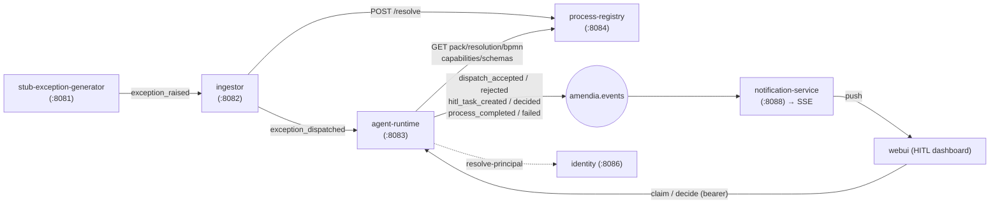
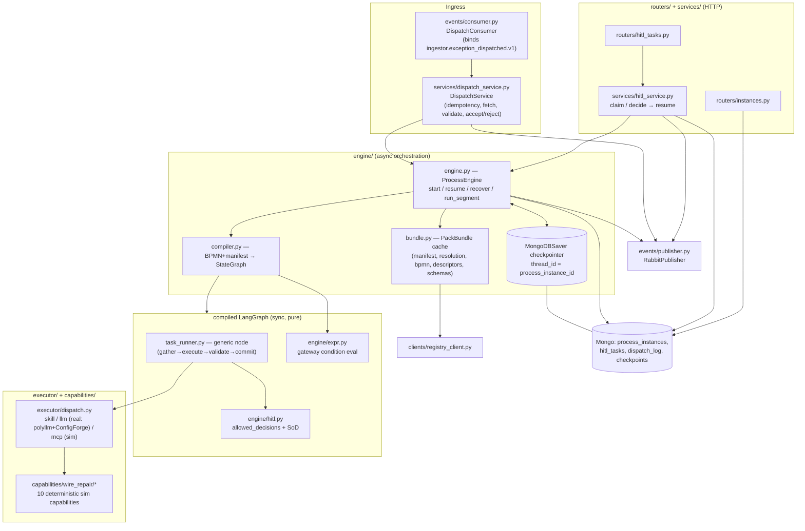
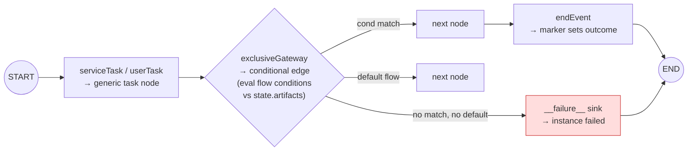
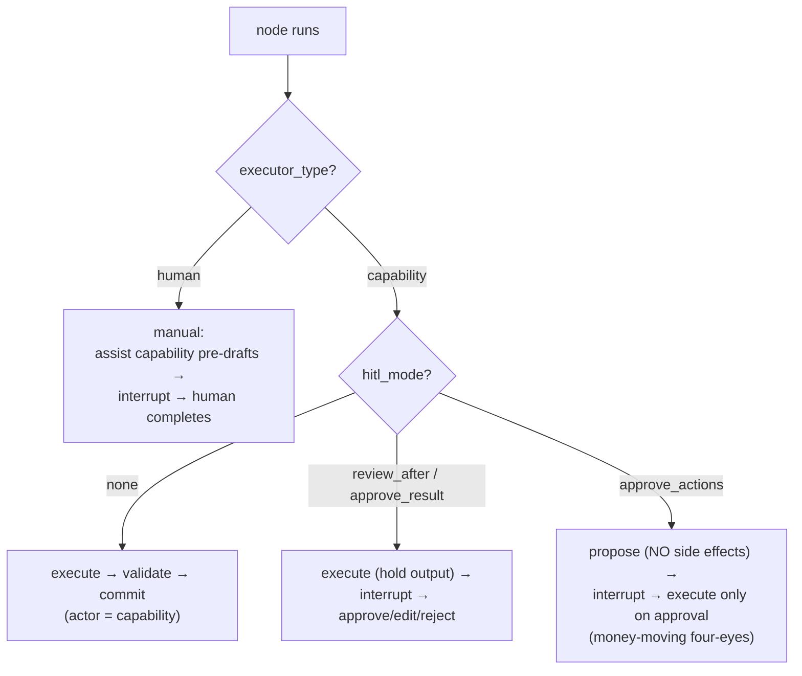
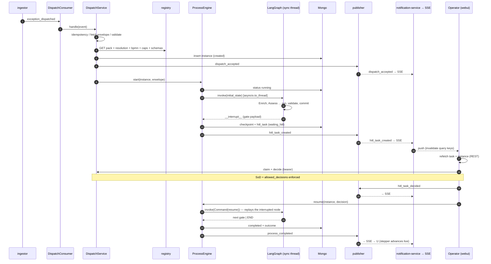
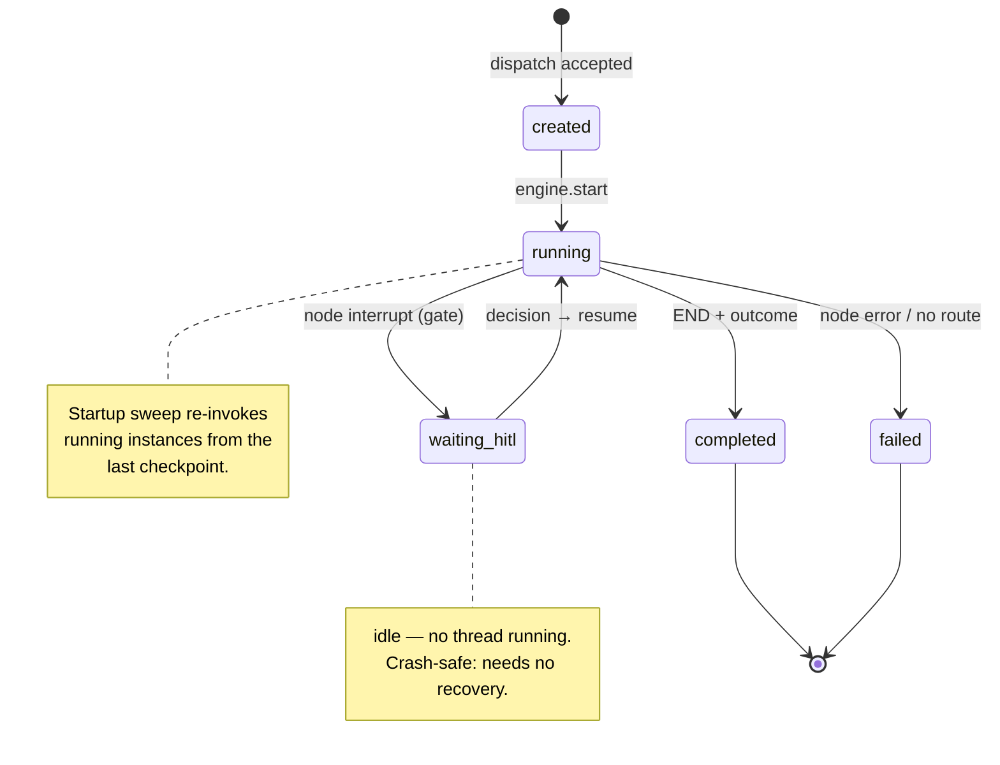

# Amendia — Agent-runtime Process Execution Pipeline

How the **agent-runtime** turns an inbound payment-exception dispatch into a fully-executed
process — driven by the **ProcessPack as the single source of truth**, gated by real human
approvals, checkpointed at every step, and streamed to the dashboard in real time.

This is the maintained reference for the execution engine. It complements **ADR-009**
(foundation: contracts, persistence, seed) and **ADR-011** (execution: LangGraph compilation,
capability execution, real HITL), and connects to **ADR-015** (the SSE push of the events this
pipeline emits). Service surface is catalogued in `amendia_services_reference.md` §3.

---

## 1. Where it sits

The runtime is the consumer-side executor. An exception flows stub → ingestor → registry (triage) →
**agent-runtime** (execute) → operator UI, entirely over a durable RabbitMQ topic exchange
(`amendia.events`) plus a few internal HTTP reads.



The runtime **executes** BPMN natively by compiling it to a LangGraph graph — there is no external
BPMN engine. Bindings, HITL modes and SoD policies live in the **manifest**, not the BPMN XML.

---

## 2. Guiding principles

- **The ProcessPack is the single source of truth.** The manifest (bindings, HITL modes, SoD
  policies), the pinned capability descriptors, the pinned artifact JSON Schemas, and the BPMN
  together fully determine execution. The runtime interprets them; it invents nothing.
- **Sync, pure graph nodes / async engine.** Graph nodes do **no I/O** — they gather inputs, run a
  capability through an injected executor, validate outputs, and return a state delta. All I/O
  (Mongo, RabbitMQ, registry HTTP) lives in the async engine *around* the graph. The Mongo
  checkpointer ships sync-only, so the graph is invoked inside `asyncio.to_thread`.
- **Human gates = interrupt/resume.** A HITL gate is a LangGraph `interrupt(payload)`; a decision is
  a `Command(resume=decision)`. The engine materializes a task doc from the interrupt and resumes the
  same thread on decision — the *same* code path powers fresh runs and crash recovery.
- **The checkpoint trail is the audit record.** A checkpoint at every node boundary + an append-only
  `actor_log` (which capability/human touched each element, when) make execution replayable and
  attributable.

---

## 3. Components



Key files: [`services/dispatch_service.py`](../services/agent-runtime/app/services/dispatch_service.py),
[`engine/engine.py`](../services/agent-runtime/app/engine/engine.py),
[`engine/compiler.py`](../services/agent-runtime/app/engine/compiler.py),
[`engine/task_runner.py`](../services/agent-runtime/app/engine/task_runner.py),
[`engine/hitl.py`](../services/agent-runtime/app/engine/hitl.py),
[`engine/executor/dispatch.py`](../services/agent-runtime/app/engine/executor/dispatch.py),
[`services/hitl_service.py`](../services/agent-runtime/app/services/hitl_service.py),
[`engine/state.py`](../services/agent-runtime/app/engine/state.py).

---

## 4. The execution state

The graph's state ([`engine/state.py`](../services/agent-runtime/app/engine/state.py)) is a
JSON-serializable `TypedDict` with reducer channels, so the checkpointer can persist it at every node
boundary:

| Channel | Reducer | Meaning |
|---|---|---|
| `envelope` | replace | the full wire-exception envelope (read-only input) |
| `artifacts` | **dict-merge** | typed outputs by binding name — each node overlays its deltas |
| `actor_log` | **append** | `{element_id, actor, kind: capability\|human, at}` per touch |
| `trace` | replace | `{correlation_id, causation_id}` |
| `pack` | replace | `{pack_key, pack_version}` |
| `outcome` / `last_error` | replace | set by the end-marker / failure sink |

---

## 5. Stage-by-stage pipeline

### 5.1 Ingress → accept-or-reject

A durable consumer binds `ingestor.exception_dispatched.v1` and hands each event to
[`DispatchService.handle`](../services/agent-runtime/app/services/dispatch_service.py). The gatekeeper
([`_handle`](../services/agent-runtime/app/services/dispatch_service.py)) — every failure publishes a
`dispatch_rejected` reply (which the ingestor reconciles):

1. **Record** the event in `dispatch_log` (idempotent).
2. **Idempotency key** `(exception_id, pack_key, pack_version)` → if an instance exists, re-emit
   `dispatch_accepted` and stop (safe under redelivery/replay).
3. **Fetch** the envelope from `fetch_url` → failure = `fetch_failed`.
4. **Validate** it against `WireExceptionEnvelope` → failure = `envelope_invalid`.
5. **Load the pack bundle** from the registry → unknown = `unknown_pack`, not-active = `pack_not_active`.
6. **Create** the `process_instances` doc (`created`), **publish `dispatch_accepted`**, and **spawn**
   `engine.start(instance, envelope)` as a background task.

### 5.2 Pack loading & compilation (once per version, cached)

[`ProcessEngine.load_bundle`](../services/agent-runtime/app/engine/engine.py) pulls **manifest** (must be
`active`), **resolution** (range→exact pins), **BPMN** (parsed by the shared `amendia_bpmn`), the pinned
**capability descriptors** and pinned **artifact schemas**, and caches the `PackBundle` forever (packs are
immutable once active). [`compile_graph`](../services/agent-runtime/app/engine/compiler.py) then maps the
validated BPMN subset to a LangGraph `StateGraph` (also cached), attaching the Mongo checkpointer.



Unsupported constructs are compile errors that fail loudly: `parallelGateway` (out of scope — the seed
BPMN was linearized), chained gateways, unbound tasks, multi-outgoing tasks.

### 5.3 Segment execution

[`_run_segment`](../services/agent-runtime/app/engine/engine.py) invokes the compiled graph with
`thread_id = process_instance_id` inside `asyncio.to_thread`. A **segment** is a bounded run ending at the
next human gate or at `END`. Three outcomes: the graph **raises** → `failed`; the result contains
**`__interrupt__`** → materialize a HITL task; a **terminal dict** → `completed`.

### 5.4 Node execution & the four HITL modes

Every node runs the same pipeline in [`task_runner.py`](../services/agent-runtime/app/engine/task_runner.py):
**gather inputs → run capability (via the executor) → validate outputs against the pinned schema → commit
artifacts + append `actor_log`.** The capability is dispatched by kind in
[`executor/dispatch.py`](../services/agent-runtime/app/engine/executor/dispatch.py): `skill` imports
`runtime.entrypoint`. When `AGENTRT_SIMULATION_MODE=true` (the code default), `llm`/`mcp` route to a paired
**deterministic simulation** capability. When simulation is off (the deployed default), `llm` capabilities
call a **real, config-driven model** via polyllm + ConfigForge — the config ref is the capability's own
`model_config_key` if declared, else the runtime default `AGENTRT_LLM_CONFIG_REF` — while `mcp` (no real
client yet) falls back to the simulation skill. See **ADR-016** and the LLM configuration guide. What
happens around the execute step depends on the binding's HITL mode:

**`deep_agent` nodes (ADR-021).** A fourth kind runs a **bounded Deep Agents loop** inside the node — but
**only in `nemoclaw` mode** (the worker/sandbox supplies the runner; the native/in-process path refuses it,
fail closed). It is **always** behind a HITL gate and **always memoized** (mandatory, independent of the
opt-in flag) so the reviewed verdict — not a fresh agent run — commits on resume. The loop is caged by the
pinned output schema (host-validated), a `tools` whitelist + inference-proxy egress (injection resistance,
§9.6), a step budget, and the HITL gate. The BPMN still dictates order/routing/gates; the harness never
sees the plan (ADR-017 trap 7). CI drives it via the deterministic `FakeDeepAgentRunner`.



| Mode | Agent runs | Human sees | On approve |
|---|---|---|---|
| `none` | execute | — | committed autonomously |
| `review_after` | execute (held) | the produced artifact | approve / **edit_and_approve** (re-validated) / reject |
| `approve_result` | execute (held) | the produced artifact | approve / reject (no edit) |
| `approve_actions` | **propose** (no side effects) | proposed actions | approve → execute (optionally a subset), else reject |
| `manual` | assist pre-draft | draft + inputs | complete (with edits) / escalate |

`edit_and_approve` and manual edits are re-validated against the pinned schema before commit; two rejects
fail the node (v1 policy).

### 5.5 HITL interrupt → task → decision → resume

When a node interrupts, the async engine
([`_materialize_task`](../services/agent-runtime/app/engine/engine.py)) turns the interrupt payload into a
`hitl_tasks` doc: mode-derived `allowed_decisions`, pinned-schema payload snapshots, `proposed_actions` for
`approve_actions`, and **`sod.excluded_users`** computed from the pack's `distinct_actor` policies × the
instance's `actor_log` ([`compute_sod_excluded`](../services/agent-runtime/app/engine/hitl.py)). It flips the
instance `running → waiting_hitl` and publishes `hitl_task_created`. The instance now idles (no thread
running) until a human acts.

The decision API ([`services/hitl_service.py`](../services/agent-runtime/app/services/hitl_service.py)),
identity taken from the bearer (never the body):
- `POST /hitl-tasks/{id}/claim` — 409 unless `open`, **403 if SoD-excluded**, 403 if role ∉ caller's roles.
- `POST /hitl-tasks/{id}/decide` — checks claim ownership, **re-checks SoD**, verifies `decision ∈
  allowed_decisions`, re-validates edits, persists an immutable `DecisionRecord` (`decided_by = usr-…`),
  publishes `hitl_task_decided`, then calls `engine.resume(...)`. Resume flips `waiting_hitl → running` and
  re-invokes the graph with `Command(resume=decision)`. **LangGraph replays only the interrupted node from
  the top**, the `interrupt(...)` returns the decision, the node commits, and the segment runs on to the
  next gate or `END`.

Because only the interrupted node replays and simulation capabilities are deterministic, `propose` re-runs
have no side effects and `execute` runs exactly once, post-approval. **Caveat for real `llm` capabilities:**
replay would re-invoke the model on resume, so a `review_after` node would call the LLM again after approval
and the regenerated artifact — not the one the human reviewed — would commit. **Fixed in ADR-019** by
per-instance **memoization** keyed on `(process_instance_id, element_id, inputs_hash, attempt)`: on resume
the node replays cheaply from a runtime-private Mongo memo and the **reviewed** artifact commits; a genuine
`reject → re-run` (fresh `attempt`) still re-invokes. Enabled by default in `nemoclaw` mode; in `native` via
`AGENTRT_MEMOIZE_CAPABILITIES` (default off → byte-identical).

**MCP / `nemoclaw` note (ADR-020):** OpenShell has no inbound execute API (ADR-019), so the real
`nemoclaw` path **inverts the transport** — the host publishes a `capability_exec_request` job and an
in-sandbox **capability-worker** consumes it (egress), runs the shared execution core, and replies. The
`OpenShellClient.run_capability` seam is unchanged (`BrokerOpenShellClient` in place of the retired HTTP
client). In the worker, `llm` runs against `inference.local/v1`, **`mcp` runs for real** via the
the descriptor's self-descriptive `endpoint` (ADR-024) with its `tools` whitelist (`list_provider` stub in dev — the simulation fallback is
retained only for the fake/native paths and logged at the boundary), and side-effect skills run
sandboxed (action still simulated in dev). The host still validates, commits, checkpoints, memoizes, and
appends `actor_log` (with the worker's OTLP trace id). Contract-derived **egress policy** feeds
sandbox-creation provisioning. CI runs on the in-memory transport; the real RabbitMQ round-trip is
env-gated.

### 5.6 Termination

`END` → the instance is `completed` with the `endEvent` id as `outcome` and the sorted `artifact_names`;
`process_completed` is published. Any unhandled node error → `failed` + `last_error`; `process_failed`
published.

---

## 6. End-to-end sequence (with one HITL gate)



---

## 7. Instance lifecycle



---

## 8. Cross-cutting guarantees

- **Checkpointing** — `langgraph-checkpoint-mongodb`, `thread_id = process_instance_id`, a checkpoint at
  every node boundary. `GET /instances/{id}` exposes status/outcome/artifacts/`actor_log`/HITL links;
  `GET /instances/{id}/state` (debug-flag) returns the checkpointed state.
- **Idempotency & replay** — the `(exception_id, pack, version)` key + guarded state transitions
  make broker redelivery a safe no-op.
- **Crash recovery** — [`recover`](../services/agent-runtime/app/engine/engine.py) re-invokes any instance
  left `running` from its last checkpoint on startup; `waiting_hitl` instances resume when a human decides.
- **Separation of duties** — computed per instance from `distinct_actor` policies × `actor_log`; enforced at
  both **claim and decide**, keyed on the durable `amendia_user_id`.
- **Events out** — `dispatch_accepted/rejected`, `hitl_task_created/decided`, `process_completed/failed`.
  The runtime emits them; the **notification-service** (ADR-015) consumes them and pushes thin invalidation
  signals to the dashboard over SSE, so the UI reflects the true current state at every transition without
  polling.

---

## 9. Worked example — `wire-repair-standard` (AC01)

```
dispatched → running
  Task_EnrichPayment        serviceTask  cap.enrich_investigation      hitl=none         (autonomous)
  Task_AssessRepairability  serviceTask  cap.assess_beneficiary        hitl=review_after → HUMAN (analyst)
  Gateway_Repairable        exclusiveGW  route on repair_verdict
  Task_DraftRepair          serviceTask  cap.draft_repair              hitl=review_after → HUMAN (analyst)
  Task_ApproveRepair        userTask     role.payments.ops_approver    hitl=manual/approve_actions → HUMAN (approver)
    └─ SoD: the analyst who drafted is excluded from approving (four-eyes)
  Task_ApplyRepair          serviceTask  cap.apply_repair              hitl=approve_actions (money move)
  Task_NotifyParties → Task_RecordResolution → End_Resolved
→ completed (outcome = End_Resolved)
```

The `BE04` path instead parks at the `Task_ObtainInfo` manual gate. Every gate publishes a
`hitl_task_created`; every decision a `hitl_task_decided`; the terminal a `process_completed` — each pushed
live to the dashboard.

---

## 10. Scope & deferred

Executed subset: linear flows + exclusive gateways; four HITL modes; deterministic simulation capabilities.
**Deferred:** parallel gateways, timers/escalation/expiry, compensation; real MCP and non-trivial LLM
execution (a minimal flagged LLM path exists); per-activity event granularity (lifecycle events already
bracket every transition — see ADR-015). Editing the seed requires `docker compose … down -v` (active packs
are immutable).
