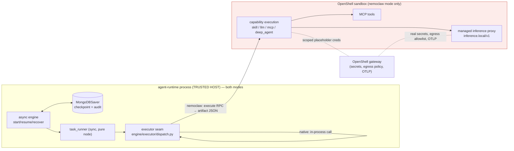
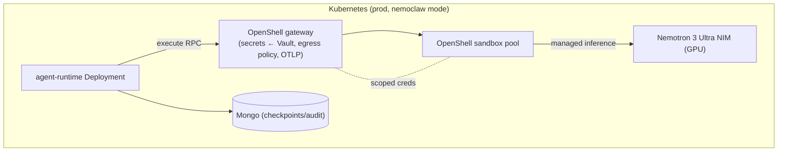

# Amendia — Securing the Agent-Runtime with NemoClaw / OpenShell

**Type:** Design & planning doc (pre-ADR)
**Date:** 2026-07-10 · **Rev:** v2
**Author:** drafted with Claude (Cowork), for Sandeep
**Status:** Proposal for review — not yet an accepted ADR

**Related (existing):** ADR-009 (agent-runtime foundation), **ADR-011** (execution: LangGraph
compilation, the *executor seam*, HITL), **ADR-016** (real LLM via polyllm + ConfigForge),
ADR-015 (notification-service/SSE), `amendia_agent_runtime_execution_pipeline.md`,
`amendia_llm_configuration_guide.md`, `amendia_platform_contracts_v1.md`,
`amendia_contracts_reference.md`.

**External:** NVIDIA + LangChain **NemoClaw Deep Agents Blueprint** (announced 2026-07-08).

> **Rev v2 changes.** (1) NemoClaw usage is now a first-class **execution mode** —
> `native` (today's behaviour, unchanged) vs `nemoclaw` (OpenShell substrate) — §4. (2) The v1
> stance "don't adopt the Deep Agents harness" is **refined**: the harness has a legitimate,
> bounded role at the **capability** level (never the orchestration level), available only in
> NemoClaw mode — §9.

> **Confidence note.** NemoClaw shipped on 2026-07-08; its docs are days old and still moving.
> Everything about Amendia is grounded in your ADRs. Everything about NemoClaw's internals
> (gateway API, sandbox lifecycle verbs, harness SDK, Helm chart names) is drawn from the launch
> blog, the NIM blueprint page, and the quickstart, and is flagged **[confirm]** where a concrete
> integration detail must be checked against the live docs before we build.

---

## 1. Recommendation in one paragraph

Make NemoClaw a **configurable execution mode**, not a rewrite. In the default **`native`** mode the
agent-runtime behaves exactly as it does today (in-process executor, polyllm/ConfigForge, existing
simulation flags). In **`nemoclaw`** mode, capability execution is delegated to **OpenShell**
(NemoClaw's secure sandbox runtime) behind Amendia's existing **executor seam**
(`engine/executor/dispatch.py`) — the smallest boundary that still covers 100% of the external-call
and money-moving surface. Keep the **orchestration plane deterministic in both modes**: BPMN → a
compiled LangGraph is the plan, and the plan is never handed to an autonomous agent. Within
`nemoclaw` mode, a capability *may* opt into the **Deep Agents Code harness** for genuinely agentic,
read-only, investigative steps — caged by pinned schemas, egress policy, and the HITL gate around it
— and this is where **Nemotron 3 Ultra** (whose ~10× cost/perf claim is measured *on that harness*)
earns its place, wired as a config-selectable polyllm provider alongside Bedrock/OpenAI/Gemini. Ship
it in **docker-compose** for dev and **Kubernetes/Helm** for production.

---

## 2. What NemoClaw is — and what we take from it

NemoClaw is a **blueprint**, not one product. Three layers:

| Layer | What it is | Adoption |
|---|---|---|
| **Model** — Nemotron 3 Ultra | NVIDIA open model; ~10× cost/perf claim vs closed peers *on the Deep Agents harness* | **Optional** — one more selectable LLM behind polyllm/ConfigForge (§6); best paired with deep-agent capabilities (§9) |
| **Harness** — Deep Agents Code | LangChain's autonomous agent harness (plan / tool-use / memory / task execution) | **Bounded** — at the **capability** level only, in `nemoclaw` mode, sandboxed; **never** at the orchestration level (§9) |
| **Runtime** — **OpenShell** | Secure, governed, containerized sandbox: egress policy, credential isolation, managed inference proxy, OTLP tracing, MCP integration | **Yes — the core adoption**, gated by execution mode (§4) |

What OpenShell gives us that we don't have today: container sandboxing with a managed interpreter
that blocks unapproved shell/exec; **network-egress allowlisting** per capability; **credential
isolation** (real secrets stay in the host gateway; the sandbox sees only scoped placeholders); a
**managed inference proxy** (`inference.local/v1`); **OTLP tracing** per execution; and **native MCP**
brokering.

---

## 3. Why the executor seam is the boundary

Amendia's engine already made this easy (ADR-011, execution-pipeline reference):

> Graph nodes are **pure / synchronous and do no I/O**. They gather inputs, run a capability through
> an *injected executor*, validate outputs against the pinned schema, and return a state delta.
> **All** I/O — Mongo checkpointing, RabbitMQ, registry HTTP — lives in the async engine *around* the
> graph. Capability dispatch is concentrated in `engine/executor/dispatch.py`, routing by kind.

Every dangerous thing — arbitrary `skill` code, real `llm` calls, `mcp` tool calls, and the
money-moving `apply_repair` / `notify_parties` / `execute_return` — passes through that **one seam**.
Everything that must stay fast, transactional, and trusted — the Mongo checkpointer (the audit
trail), Rabbit consumers, the HITL decision API — is already on the other side. Jailing the whole
`:8083` service would drag the checkpointer inside the boundary and *widen* the credential surface;
the executor seam is the minimal cut that still covers the whole external surface.



---

## 4. NemoClaw as a configuration mode (`native` vs `nemoclaw`)

The whole integration is gated by one setting; nothing about today's behaviour changes unless it's
switched on. This mirrors how you already gate `AGENTRT_SIMULATION_MODE`.

### 4.1 The selector

```yaml
AGENTRT_EXECUTION_MODE: native      # default — today's in-process executor, unchanged
# AGENTRT_EXECUTION_MODE: nemoclaw  # OpenShell sandbox substrate for capability execution
```

At wiring time the engine injects the executor implementation:

```
executor = (
    SandboxedExecutor(openshell_client)   if settings.EXECUTION_MODE == "nemoclaw"
    else InProcessExecutor()              # today's dispatch.py path, byte-for-byte
)
```

The pure-node/task-runner code is **untouched** — both executors satisfy the same
`execute(context) → outputs` contract, and the node still validates outputs against the **pinned**
artifact schema exactly as now.

### 4.2 The `nemoclaw`-mode config set

Grouped so an operator flips a coherent profile, not scattered knobs:

| Setting | Meaning |
|---|---|
| `AGENTRT_EXECUTION_MODE` | `native` \| `nemoclaw` — the master switch |
| `AGENTRT_OPENSHELL_URL` | gateway endpoint (sandbox dispatch, secret brokering, OTLP) |
| `AGENTRT_NEMOCLAW_REQUIRED` | `true` = **fail closed** if the gateway is unreachable at startup; `false` = degrade to `native` with a loud warning (see 4.3) |
| `AGENTRT_SANDBOX_POOL_SIZE` | warm-sandbox pool size (§5.3) |
| `AGENTRT_LLM_CONFIG_REF` | unchanged selector; in `nemoclaw` mode may point at a managed-inference ref (§6) |
| `AGENTRT_SIMULATION_MODE` | **orthogonal** — still forces deterministic sim regardless of mode (keep CI on this) |

### 4.3 Precedence, fallback, and fail-closed

- **Orthogonality.** `EXECUTION_MODE` chooses *where* a capability runs; `SIMULATION_MODE` chooses
  *whether it's real*; `LLM_CONFIG_REF`/`model_config_key` choose *which model*. They compose. CI/tests
  stay on `native` + `SIMULATION_MODE=true` so the deterministic suites are unaffected.
- **Fail-closed is the default posture.** If an operator asked for sandboxing and the gateway is down,
  silently running capabilities *unsandboxed* is the wrong default for a payments platform — so
  `AGENTRT_NEMOCLAW_REQUIRED=true` refuses to start (or parks dispatch) rather than degrade. Set it
  `false` only in dev.
- **Per-capability requirement.** A capability may *require* the sandbox (any `deep_agent` capability,
  or a side-effectful one flagged for isolation). The **registry** validates that a pack referencing
  such a capability can only be activated/run where `nemoclaw` mode is available — a natural new
  onboarding check (contract impact in §9.4), catching "this pack needs a sandbox that isn't there" at
  activation, not at 2 a.m.

---

## 5. The SandboxedExecutor (`nemoclaw` mode)

`SandboxedExecutor` dispatches capability execution into an OpenShell sandbox and returns the
artifact(s). Per-kind mapping:

| Kind | Capabilities (seed) | Sandbox treatment |
|---|---|---|
| **`llm`** | draft_repair, draft_return, draft_rfi, record_resolution | Prompt/JSON-schema call routed through the managed inference proxy *or* out to polyllm/Bedrock — selectable by ConfigForge ref (§6). `_validate` unchanged. |
| **`mcp`** | sanctions_screen (today **sim fallback**) | OpenShell **native MCP** brokers the call under egress policy + credential isolation — the clean path to real sanctions screening. |
| **`skill` (read-only)** | enrich_investigation, assess_beneficiary | Run in sandbox; little/no egress. Defense-in-depth. |
| **`skill` (side-effectful)** | **apply_repair, notify_parties, execute_return** | Sandbox with a **tight egress allowlist** to the specific rail/gateway + **placeholder creds**. Dev keeps them simulated; the sandbox is where they *become* real safely. |
| **`deep_agent`** *(new, §9)* | e.g. an investigative variant of enrich/assess | The Deep Agents Code harness runs **inside** the sandbox, bounded by pinned IO + egress + HITL. |

**5.2 Sync/async bridge preserved.** Nodes are sync (`asyncio.to_thread`); the executor already
bridges to async work via `_run_blocking` handling both no-loop and running-loop cases (ADR-016 trap
4). A sandbox RPC is just another async call bridged the same way. **[confirm]** the OpenShell client
transport.

**5.3 Warm pool, not cold-per-node.** Capabilities are short steps and HITL `review_after` replays the
interrupted node on resume — cold-starting a container per execution would wreck latency and multiply
on replays. Use a warm pool (`AGENTRT_SANDBOX_POOL_SIZE`); OpenShell's snapshot/rebuild fits pooling.
**[confirm]** pool/snapshot semantics.

---

## 6. LLM: both paths, selectable by config

Purely additive to ADR-016. Add one polyllm provider adapter — `providers/nemoclaw.py` (provider key
`nemoclaw`) — targeting the managed inference proxy (OpenAI-compatible **[confirm]**), and register
ConfigForge entries:

```jsonc
{ "env":"dev","kind":"llm","provider":"nemoclaw","name":"nemotron-ultra",
  "data": { "provider":"nemoclaw", "model":"nemotron-3-ultra",
            "base_url":"https://inference.local/v1", "json_mode":true,
            "temperature":0.1, "api_key_ref":"env:OPENSHELL_INFERENCE_TOKEN" } }
// → ref: dev.llm.nemoclaw.nemotron-ultra
```

Selection stays pure configuration: platform-wide via `AGENTRT_LLM_CONFIG_REF`, or per-capability via
`runtime.model_config_key` (keep draft_repair on Claude/Bedrock for quality, move draft_rfi to
Nemotron for cost). Routing inference through the sandbox proxy *also* moves provider keys out of the
agent-runtime container into the gateway (§7) — a strict improvement even for the existing paths.
(ADR-016 trap 3 still applies: descriptor edits require re-onboarding; ConfigForge edits don't.)

---

## 7. Credential & egress model — the security upgrade

Today (ADR-016 trap 1) secrets are *references*, but the referenced values live in the
**agent-runtime container's environment** — so the process holds real keys. Under OpenShell: real
secrets move to the **gateway** on the host; the sandbox gets **scoped placeholders** and never holds
the raw value; **egress allowlists** mean a buggy/compromised capability can't reach anything outside
its declared endpoints. This is the natural home for the `literal:→vault:` migration ADR-016
anticipated — the gateway is the broker; Vault backing becomes an infra concern, not an Amendia code
change. Derive each capability's egress allowlist from **already-declared contract data**
(`mcp.endpoint` host [ADR-024], the rail endpoint, the inference proxy), so policy is a function of the contract,
not a parallel hand-maintained list. **[confirm]** how OpenShell expresses per-sandbox egress policy.

---

## 8. HITL, determinism, and the audit trail

Two invariants must survive the sandbox:

1. **Host checkpoints; sandbox returns data.** The checkpoint-per-node-boundary + append-only
   `actor_log` is the audit record. The sandbox executes *inside* a node; the **host** commits and
   checkpoints exactly as today. Thread OpenShell's OTLP trace id into the `actor_log` entry so the
   audit links "which sandboxed execution, which egress, which model" to each element touch.
2. **`review_after` re-runs on resume** (ADR-016 trap 2), and a sandbox round-trip sharpens it. The
   planned fix — **memoize the produced artifact per `(element, inputs)` within the instance** — is
   the right place to implement in `SandboxedExecutor`, and becomes *mandatory* for non-deterministic
   `deep_agent` capabilities (§9). Recommend bundling memoization into this work.

---

## 9. Deep Agents Code harness for **agentic capabilities** (NemoClaw mode)

This is the refinement of v1's over-blunt "don't adopt the harness." The harness *does* have a place —
just not where it would dissolve the platform's safety argument.

### 9.1 Two planes of autonomy

| Plane | Mechanism | Autonomy | Why |
|---|---|---|---|
| **Orchestration** | BPMN → compiled LangGraph (`compiler.py`) | **Deterministic. Non-negotiable.** | Bijection, exclusive-gateway routing, SoD, pinned versions, and the checkpoint audit trail are *the* reasons a bank trusts this. An emergent agent choosing the next step would break every one. **The BPMN is the plan; we never delegate the plan.** |
| **Execution (inside one node)** | a capability's `kind` | Ranges from fixed code to a bounded agent loop | A single step's *internal* work can be genuinely open-ended. That's a capability implementation detail, caged by the node's contract. |

So "Deep Agents harness based on the BPMN" resolves to: **the BPMN still dictates which steps run, in
what order, and where humans gate; the harness is an execution substrate for individual capabilities
that need real agentic reasoning** — nothing more.

### 9.2 What a `deep_agent` capability is

A new capability execution style (new `kind: "deep_agent"`, or a `runtime` variant — §9.4),
runnable **only** in `nemoclaw` mode inside an OpenShell sandbox. Given pinned input artifacts + a task
spec + a **whitelisted toolset** (fetch attachment, search payment history, name-match, sanctions
pre-check), the Deep Agents Code harness plans, uses tools, and **must emit output conforming to the
pinned artifact schema**. It is caged by: schema-validated output, egress allowlist, `timeout_seconds`
/ `max_retries`, the HITL mode wrapped around it, and `actor_log` + OTLP. The contract boundary — not
the (now emergent) code — is the guarantee.

### 9.3 Where it fits — and where it must not go

**Good fit (read-only, investigative, open-ended):**
- `cap.payment.enrich_investigation` — assemble the dossier by reasoning over attachments,
  correspondence, and history.
- `cap.payment.assess_beneficiary` — produce `repair_verdict` **with `evidence[]`** (name-match,
  history, correspondence) — a genuine investigation, and read-only.
- `cap.payment.draft_rfi` — draft the analyst's RFI from messy context.

These are exactly where Nemotron-on-Deep-Agents economics land, and their read-only nature keeps
emergent behaviour low-risk. They stay wrapped in their existing HITL gates (`review_after` / `manual`),
so a human still confirms the output.

**Must NOT go there:**
- **Orchestration / gateway routing** — stays in the BPMN/compiler, always.
- **Side-effectful steps** (`apply_repair` etc.) — the harness may *propose* under `approve_actions`,
  but the side effect stays deterministic and human-gated. Never let an autonomous loop move money.
- **Anything needing bit-exact reproducibility without memoization** — agent loops are
  non-deterministic; §8.2 memoization is required for these nodes so the reviewed artifact is the
  committed artifact.

### 9.4 Contract impact (deliberate, additive)

Introducing `deep_agent` is a real contract extension (a new `kind`/`runtime` variant in the
capability descriptor), so it's opt-in and versioned: existing packs are unaffected; a pack using a
`deep_agent` capability declares it, and the registry validates (a) the toolset whitelist resolves,
(b) side-effect class is `read_only` unless explicitly justified, (c) a HITL gate is present, and (d)
the pack can only activate/run where `nemoclaw` mode is available (§4.3). New descriptor ⇒
re-onboarding (ADR-016 trap 3) — expected.

### 9.5 A second, safe use: the harness as a **pack-authoring** aid (dev-time, not runtime)

Tempting interpretation: feed the BPMN task list into Deep Agents' planning/todo primitive and let the
agent "work the process." **Reject that at runtime** — it re-creates the emergent-orchestration
problem. But the Deep Agents Code harness is, literally, a *coding* agent — so point it at pack
*authoring* instead: read a bank's BPMN + procedure docs and **draft** the bindings, capability
descriptors, and artifact schemas for a human to review and onboard through the registry's normal
validated lifecycle. That uses the harness's actual strength (writing/editing config) with zero
runtime-governance risk, and could meaningfully cut onboarding effort. Worth a separate spike.

### 9.6 Prompt/tool-injection note

A `deep_agent` reads **untrusted** bank documents (attachments, correspondence) — a prompt-injection
surface. This is actually a strong argument *for* OpenShell: the egress allowlist + tool whitelist mean
even a fully hijacked agent loop can't reach anything it wasn't granted. Injection resistance is a
reason to run these in the sandbox, not merely a risk of doing so.

---

## 10. Phased rollout

| Phase | Scope | Gate | Exit proof |
|---|---|---|---|
| **1 — Mode + seam** | `AGENTRT_EXECUTION_MODE`; `SandboxedExecutor` for **`mcp` + `llm`**; `native` stays default/fallback. | mode flag | AC01 runs to `End_Resolved` in `nemoclaw` mode with `llm` executing *through* the sandbox; gateway + OTLP ids in `actor_log`. |
| **2 — Inference** | polyllm `nemoclaw` provider + ConfigForge refs; Bedrock/OpenAI/Gemini and Nemotron selectable. | ConfigForge ref | One-line `AGENTRT_LLM_CONFIG_REF` swap to Nemotron and back; per-capability override shown. |
| **3 — Side-effect skills + real MCP + memoization** | side-effectful skills into the sandbox with egress allowlists + brokered creds; real sanctions MCP; per-instance artifact memoization (fixes trap 2). | egress policy + `approve_actions` | real MCP under egress policy; side-effects jailed; resume no longer re-invokes the model. |
| **4 — `deep_agent` capability** | new `kind`; one investigative capability (assess_beneficiary) on the Deep Agents harness + Nemotron; registry validation (§9.4). | contract ext + mode-required | assess produces a schema-valid `repair_verdict` with `evidence[]` via a bounded agent loop; HITL review intact; memoized. |
| **5 — Prod hardening** | K8s/Helm; Nemotron NIM on GPU nodes; NetworkPolicy egress; Vault-backed gateway secrets; OTLP → collector. Optionally evaluate fuller service isolation. | Helm values | production stack, governed egress, Vault, end-to-end audit + traces. |

---

## 11. Deployment

**Dev — docker-compose.** Add `openshell-gateway` (+ sandbox runtime) to
`backend/deploy/docker-compose.yml` alongside mongo/rabbit/keycloak/identity/config-forge
**[confirm]** image/fragment. `agent-runtime` gains `AGENTRT_EXECUTION_MODE: nemoclaw`,
`AGENTRT_OPENSHELL_URL`, `AGENTRT_NEMOCLAW_REQUIRED: "false"` (dev), `depends_on: openshell-gateway`.
**Nemotron needs a GPU** — keep `AGENTRT_LLM_CONFIG_REF` on Bedrock locally and point the `nemoclaw`
provider at a hosted **NVIDIA NIM** endpoint when specifically testing managed inference. Keep CI on
`native` + `SIMULATION_MODE=true`.

**Prod — K8s/Helm.** OpenShell gateway + sandbox pool as workloads; **Nemotron 3 Ultra NIM** on a GPU
node pool; `agent-runtime` Deployment wired via Helm values; **NetworkPolicies** encode egress at the
cluster layer (belt-and-suspenders with OpenShell policy); gateway secrets backed by Vault; OTLP → your
collector, joined to the Mongo audit trail by `process_instance_id` + `correlation_id`.



---

## 12. Risks & traps

1. **Latency** — sandbox round-trips per node + on HITL replay. Warm pool + memoization (Phases 3–4).
2. **Nemotron GPU cost/availability** in dev — default dev to Bedrock; local Nemotron opt-in via NIM.
3. **Don't leak creds into the sandbox env** — placeholders-in-sandbox, secrets-in-gateway; a careless
   env passthrough silently undoes the ADR-016 trap-1 win.
4. **Determinism & audit** — host checkpoints, sandbox returns data; never let the sandbox own the
   audit write.
5. **Non-determinism of `deep_agent`** — emergent loops aren't statically checkable; the **contract
   boundary** (pinned schema + egress + HITL) is the guarantee, and memoization is mandatory so the
   reviewed artifact is the committed one.
6. **Keep autonomy off the orchestration plane** — the BPMN is the plan; the harness lives strictly
   inside a node. Don't feed the BPMN to the agent as a runtime todo-list (§9.5 is the dev-time
   exception, not a runtime one).
7. **Contract churn** — `deep_agent` is a real, versioned descriptor extension ⇒ re-onboarding; derive
   egress policy from existing contract fields to avoid a second parallel config.
8. **Prompt injection** via untrusted attachments — mitigated *by* the sandbox (egress + tool
   whitelist), a reason to run agentic capabilities in OpenShell (§9.6).
9. **Freshness** — NemoClaw is days old; every **[confirm]** must be verified against live docs.

---

## 13. Open questions to confirm against live NemoClaw docs

- Gateway **API / client transport** for dispatching an execution into a sandbox → the `_run_blocking`
  bridge and `SandboxedExecutor` client.
- Sandbox **lifecycle + snapshot** semantics → warm-pool design.
- How **per-sandbox egress policy** and **credential scoping** are declared → the "policy from
  contract" mapping.
- Managed inference proxy **API shape** (OpenAI-compatible?) → the polyllm `nemoclaw` adapter.
- **Deep Agents Code harness SDK** surface — how to run it as an *embedded* bounded task with a fixed
  toolset and a required structured output (vs the full interactive coding agent) → the `deep_agent`
  capability.
- **Native MCP** wiring — the MCP server is now self-descriptive on `mcp.endpoint` (ADR-024); how that endpoint maps to an OpenShell-brokered tool.
- Official **compose fragment / Helm charts / GPU requirements** for OpenShell + Nemotron NIM.

---

## 14. What I'd build first

A **Phase-1 spike**: `AGENTRT_EXECUTION_MODE` + `SandboxedExecutor` covering `llm` + `mcp`, in
docker-compose, proving one AC01 exception runs to `End_Resolved` in `nemoclaw` mode with
`Task_DraftRepair` executing *through* an OpenShell sandbox and the gateway/OTLP lines in the logs —
the same "executable proof" bar every prior slice cleared. `native` mode stays byte-identical
throughout. Phase 2 (Nemotron selectable) is then a config exercise; Phase 4 (`deep_agent` on
assess_beneficiary) is the first genuinely agentic capability, still behind its HITL gate.
